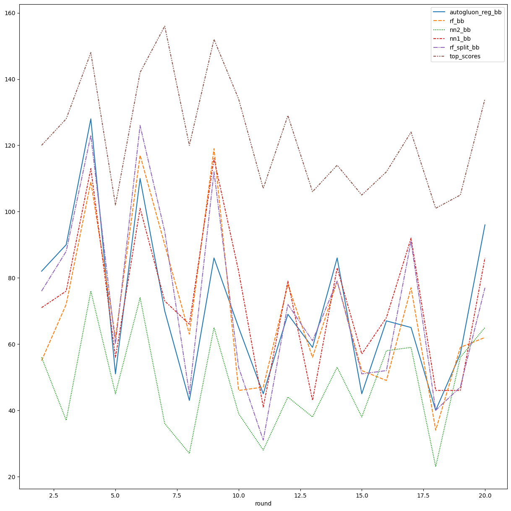

# FPL Predictor: Results

This is my report into how I used machine learning to predict the number of points scored by footballers in the fantasy football game. (FPL). To avoid confusion, I will endeavour to refer to players of the game as ‘players’ and the footballers who score the points as ‘footballers’.

The data was taken from a GitHub repo maintained by u/vaastav, without which this would not have been possible. Data ranged from the 2016/17 season to the present, with some measured metrics changing throughout this time. For the purpose of this project, I only used metrics which were common to all seasons. In the future, I would look to train smaller models to aid prediction based on more recent metrics which are more detailed, but inevitably have many fewer training examples. 

The most straightforward way to measure the performance of my models was to compare the number of points that would be scored by the model, based on predicted number of points scored. The outright predictions were passed through an algorithm which calculated the optimum footballers that could make up the squad given the limitations imposed by the game, such as the cost of the footballers in the game and the number of footballers that could come from any given team. This was remarkably complex, and as such not every possible permutation has been checked, meaning for any given game week, there may be a ‘more optimum’ team that has not been found. 

The above is the results for the first 20 rounds for the various models that I trained to predict points scored by players in the fantasy football game, with the purple dashed lined the performance of the best player in the game. The autogluon regression model, a Weighted Ensemble L2 model, and the random forest model were the best performing models, although neither came close to the best performance often. However, any score about 50 in the game is generally considered a good score, and the random forest model often achieves this. 

I also trained a split random forest model which performs slightly better. This model utilised the feature importances from the original forest to determine that it would be beneficial to have separate goalkeeper and outfield models due to the very different parameters that apply to the positions (saves, goals etc.). Interestingly, the split model was sometimes outperformed 

The neural network performed worse than expected. This is not entirely surprising given the tabular nature of the dataset. Across all models, temporal changes were modelled by having a window of 3 weeks and a cumulative average for parameters such as the number of minutes played by a given footballer. I believe that this approach has significant potential, however, if other techniques were to be incorporated, such as LSTM layers or other more complex one that deal with the temporal nature of the data. This, however, would come with its own difficulties due to the relatively limited number of datapoints and the random nature of footballer movements between leagues and teams. 

Further analysis of the results of the models provided some interesting points. Above is a graph that shows the number of time each footballer would have been chosen for a given game week, split by model. The higher figures are for footballers expected to do well, but more interesting results appear further down. Solanke appearing in this list, despite being a forward for a team currently 14th in the league would initially seem surprising, but he is, at the time of writing, in the teams of 25% of players. 

Above is a graph of feature importances for the random forest model. We can see that the transfers of players is taken into account to a relatively large extent, but I still find this result very surprising. We can see that the neural network has not taken this into account to such a large extent.  
